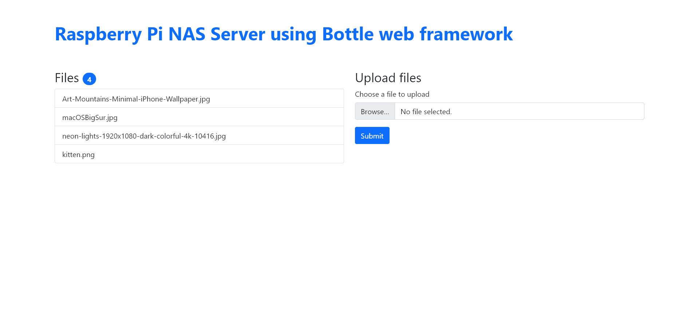

# PyNAS

A Network Access Storage (NAS) server

## Installation

Install using [poetry](https://github.com/python-poetry/poetry). Make sure you have Python 3+ installed

```bash
  poetry install
```
    
## Tech Stack

**Client:** Bootstrap

**Server:** Python, Bottle

## Screenshots


